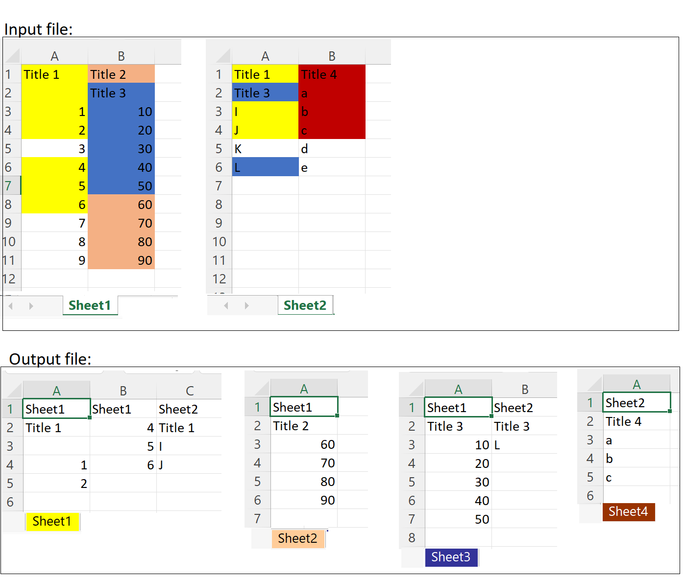

# Setup:
## Install git for windows:
In a browser go [here](https://git-scm.com/download/win), download and
run the "64-bit Git for Windows Setup"<br/>
Or<br/>
Open a administrator command prompt and run:

```
winget install --id Git.Git -e --source winget
```

## Clone the code:
Open a new command prompt and run:

```
git clone https://github.com/sunilmut/NumPPy.git
cd NumPPy
```

## Install python
Windows:
Follow the instructions [here](https://docs.microsoft.com/en-us/windows/python/scripting) to install python
on your system

## Install the necessary python modules:
In the opened command prompt, run:

```
pip3 install guizero numpy pandas xlrd xlsxwriter matplotlib openpyxl nested_dict h5py scipy pathlib
```

## Update the code:
If you have to update the code, for example to pull in a fix or an update.<br/>
**Note**
This assumes that you have already done the setup.<br/>

Open a command prompt:
```
cd NumPPy
git pull
```

# Projects:
## Run FreezeData processing app
In the opened command prompt (or open a command prompt), run:
```python
python binary.py
```

To run the app in verbose mode (to get more logs), run:
```python
python binary.py -v
```

## XLS (Excel) color sorter
Sorts the color coded data from a given .xls(x) input file and outputs
them to an .xlsx file.<br/>
It can work with up to 100 different sheets in the input file.<br/>
User can choose to extract the same colored values into either one continuous column or into separate columns in the output file.

### Example:


### Usage:
```
python colorsort.py
```
To get verbose output log fie:
```
python colorsort.py -v
```

## Run Photometry data processing app
In the opened command prompt (or open a command prompt), run:
```python
python dff.py
```

To run the app in verbose mode (to get more logs), run:
```python
python dff.py -v
```

**Note**
Close the output file prior to running.
